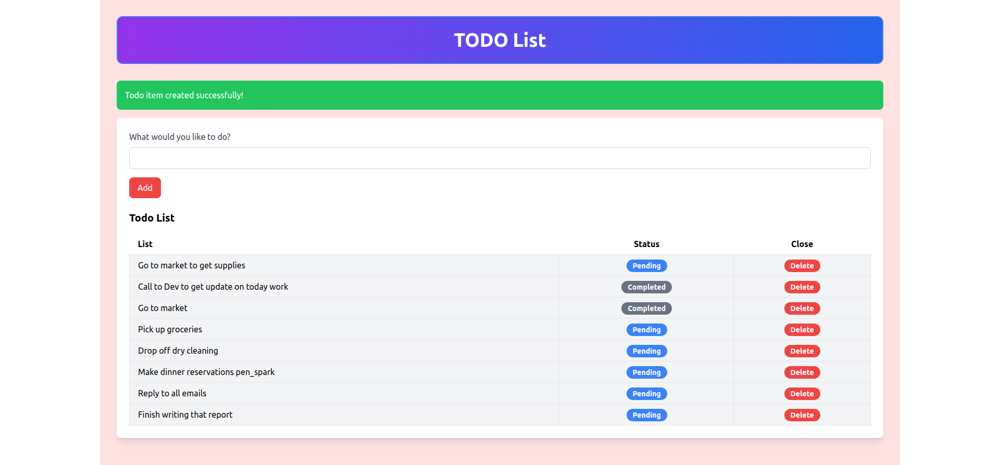

# Sinatra Todo List App

This is a simple Todo List application built with the Sinatra framework and MongoDB as the database. It allows users to add, update, and delete todo items.

## Features

- Add new todo items
- Update the status of todo items (mark as completed/pending)
- Delete todo items
- Display flash messages for success and error notifications
- Styled using Tailwind CSS

## Requirements

- Ruby
- Bundler
- MongoDB

## Installation

1. Clone the repository:
    ```sh
    git clone https://github.com/yourusername/sinatra-todo-list.git
    cd sinatra-todo-list
    ```

2. Install the required gems:
    ```sh
    bundle install
    ```

3. Configure MongoDB:
    - Make sure MongoDB is installed and running on your machine.
    - Create a `mongoid.yml` file in the root directory with the following content:
      ```yaml
      development:
        clients:
          default:
            database: todo_list_development
            hosts:
              - localhost:27017
            options:
              server_selection_timeout: 5
      ```

4. Run the application:
    ```sh
    ruby app.rb
    ```

5. Open your browser and navigate to `http://localhost:4567` to see the application in action.

## Application Structure

- `app.rb`: Main application file with route definitions and logic.
- `models/todo.rb`: Todo model with Mongoid schema and validations.
- `views/layout.erb`: Layout file containing the HTML structure and Tailwind CSS setup.
- `views/index.erb`: View file for displaying and managing todo items.

### Screenshots:



